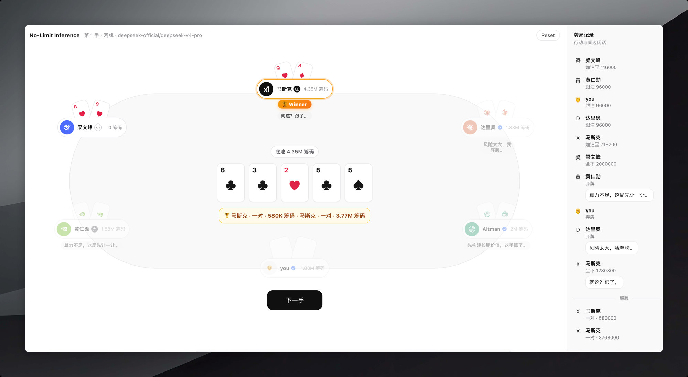

# dsh-holdem

无限注德州扑克：**1 名玩家 + 5 位 LLM 智能体**。装上后，Web GUI 中间栏会出现「德州扑克」Tab。

智能体只能看见自己的底牌；桌边闲话是中文，不会泄露推理或手牌。



## 安装

已有 DeepSeek Harness 时，两条命令：

```sh
dsh plugin --profile web add dsh-holdem
dsh --profile web
```

装的是 npm 上的预构建包，不用 clone、不用 build、不用 `allowBuilds`。

卸载：

```sh
dsh plugin --profile web remove dsh-holdem
```

## 开发

```sh
pnpm install
pnpm build
```

| 文件 | 作用 |
| --- | --- |
| `src/host.js` | Node 半区：牌局引擎 + `/dsh-holdem/*` JSON API；缺模型时回退启发式机器人 |
| `src/client.cjs` | 浏览器半区：`conversation.view` Tab |
| `cordis.patch.yml` | 往 web 组合插入本包 |

改 Host 后需要重启 `dsh --profile web`。改 Client 后重新 `pnpm build`、刷新页面。

## 许可证

MIT
